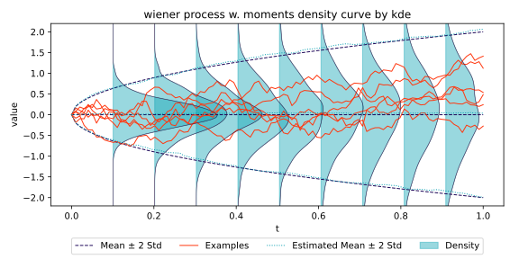

# stochplot

Tiny module for visualizations of ensembles of stochastic processes: 
- single paths
- mean and standard deviation over time
- distribution over time by a heatmap encoding the density as intensity
- distribution over time as estimated probability density curves


## Installation
Three alternatives are described. 
Choose depending on your use case and preference.

### Local Checkout - Development
Install from a local checkout (recommended for development inside a virtual environment):
```
python -m pip install -e .
```

### Installation from GitHub - Usage Only
Install the latest published source directly from GitHub:
```
pip install git+https://github.com/m-kaletta/stochplot.git
```

### Vendoring - Integration
Since the library consists (apart from examples) of only two files, vendoring is also reasonable: copy the following into your codebase.
- `src/stochplot/ensemble.py`
- `src/stochplot/visualizer.py`

## Usage

### Examples
Creating a Wiener-process ensemble and rendering some visualizations of it

```python
import numpy as np
from stochplot import Ensemble, EnsembleVisualizer


def wiener(time_len, num_steps, num_processes, seed=1):
    time_increment = time_len / num_steps
    np.random.seed(seed)
    increments = np.sqrt(time_increment) * np.random.randn(num_processes, num_steps-1)
    return Ensemble(time_len, increments=increments)

# create an ensemble of a numerical simulation of a wiener process
ensemble = wiener(1, 100, 500)
# create a visualizer object that produces plots as svg files
visualizer = EnsembleVisualizer(ensemble, 'wiener process', y_label='value', y_range=[-2.2, 2.2])
visualizer.plot_swarm()
visualizer.plot_ensemble_distribution(method='kde')
visualizer.plot_ensemble_curve_dist(method='kde')
```


Further examples can be found at
- examples/visualize_wiener_process.py — more exhaustive Wiener process visualizations.
  With analytical moments, calling
    `plot_ensemble_curve_dist(method='kde')` produces the following image:



- examples/visualize_geometric_brownian.py — geometric Brownian motion example

### Public API
- `Ensemble` in `ensemble.py` - encapsulates a collection of sample paths that approximate the stochastic process numerically. 
- `Moments` in `visualizer.py` - is a container for mean and standard deviation arrays, as they evolve over time. 
- `EnsembleVisualizer` in `visualizer.py` - provides an object that creates different plots from an `Ensemble`. 

See the docstrings for more details and the examples for concrete usage patterns.

## License
This project is licensed under the MIT License. 
See the [LICENSE](LICENSE) file for details.
